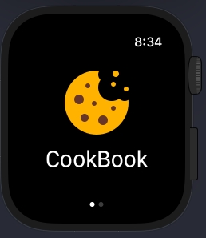
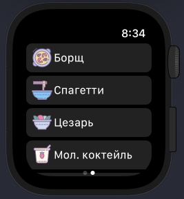
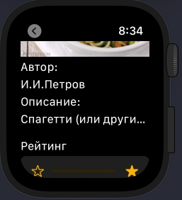

Карты и определение местоположения
========================

### Общее описание
Небольшое приложение, позволяющее просматривать рецепты и ставить рейтинг различным блюдам.  
Реализовано 4 экрана:
 - Первый - загрузочный, с иконкой и названием приложения
 - Второй - таблица с иконками рецептов
 - Третий - подробности рецепта, включающие в себя автора, рейтинг и картинку
 - Четвертый - развернутое описание приготовления блюда

### Скриншоты

